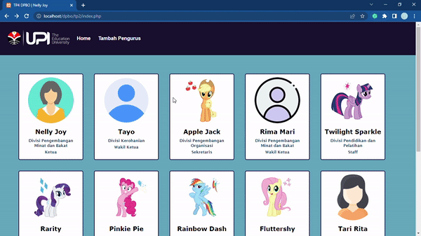
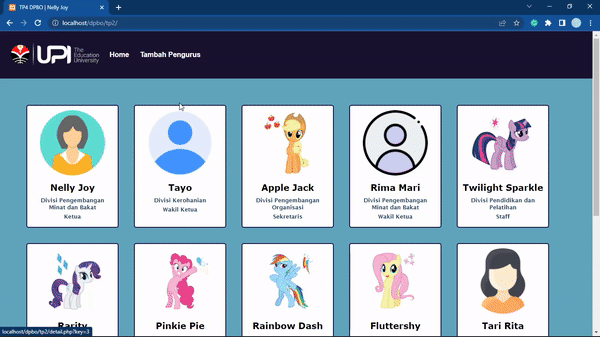
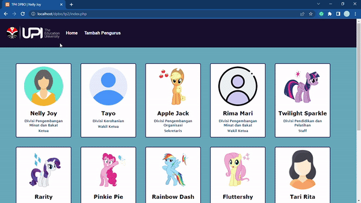
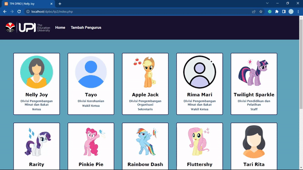

## TP2DPBO2022

Janji

>Saya Nelly Joy Christi Simanjuntak 2000199 mengerjakan TUgas Praktikum 2 dalam mata kuliah Desain dan Pemrograman Berorientasi Objek untuk keberkahanNya maka saya tidak melakukan kecurangan seperti yang telah dispesifikasikan. Aamiin

#### TP2 - PHP GUI
Pada tugas ini terdapat source code PHP dan html beserta database yang telah saya buat. Berikut penjelasan mengenai apa yang telah saya kerjakan beserta dokumentasi hasilnya.

1. Tampilan awal dimana terdapat daftar kumpulan pengurus ormawa yang ditampilkan secara tersusun (logo dan navbar dapat diklik, semua item pada card/profil juga dapat di klik)   
   
2. Tampilan detail, ketika menekan salah satu profil pengurus, maka akan diarahkan ke laman dimana ditampilkan detail profil beserta menu untuk melakukan update atau menghapus data.   
   
3. Tampilan untuk menambahkan data pengurus. Terdapat input dropdown untuk memeilih divisi dan jabatan, dimana isi dropdown diambil dari tabel kelas divisi dan jabatan.   
   
4. Tampilan ketika update detail, ketika diklik menu update pada laman detail, akan dirahakan ke laman yang berisi form dimana setiap kolom inputan form sudah berisi data dari pengurus, setelah melakukan perubahan klik save untuk menyimpan atau klik 'Cancel' untuk kembali.   
   
5. Tampilan ketika mencoba menghapus data pengurus.   
   
   

###### Sekian tugas saya, mohon maaf apabila masih terdapat banyak kesalahan atau kekurangan. Terima kasih.
